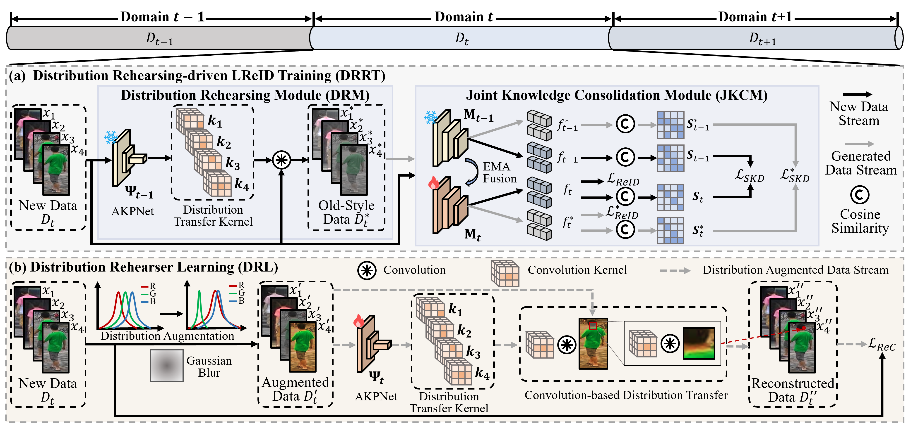
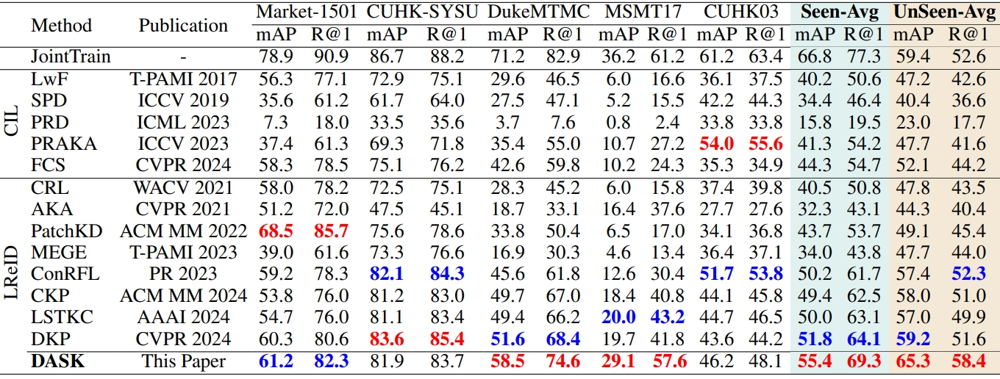

# [AAAI2025] DASK: Distribution Rehearsing via Adaptive Style Kernel Learning for Exemplar-Free Lifelong Person Re-Identification

<div align="center">

<div>
      Kunlun Xu<sup>1</sup>&emsp; Chenghao Jiang<sup>1</sup>&emsp; Peixi Xiong<sup>2</sup>&emsp; Yuxin Peng<sup>1</sup>&emsp; Jiahuan Zhou<sup>1*</sup>
  </div>
<div>

  <sup>1</sup>Wangxuan Institute of Computer Technology, Peking University&emsp; <sup>2</sup>Intel Labs

</div>
</div>
<p align="center">
  <a href='https://arxiv.org/abs/2412.09224'></a>
  <a href="https://hits.seeyoufarm.com"></a>
      
</p>

The *official* repository for  [DASK: Distribution Rehearsing via Adaptive Style Kernel Learning for Exemplar-Free Lifelong Person Re-Identification](https://arxiv.org/abs/2412.09224).




## Installation
```shell
conda create -n IRL python=3.7
conda activate IRL
pip install torch==1.13.1+cu117 torchvision==0.14.1+cu117 torchaudio==0.13.1 --extra-index-url https://download.pytorch.org/whl/cu117
pip install -r requirement.txt
python setup.py develop
```
## Prepare Datasets
Download the person re-identification datasets [Market-1501](https://drive.google.com/file/d/0B8-rUzbwVRk0c054eEozWG9COHM/view), [MSMT17](http://www.pkuvmc.com/dataset.html), [CUHK03](https://github.com/zhunzhong07/person-re-ranking/tree/master/evaluation/data/CUHK03), [SenseReID](https://drive.google.com/file/d/0B56OfSrVI8hubVJLTzkwV2VaOWM/view?resourcekey=0-PKtdd5m_Jatmi2n9Kb_gFQ). Other datasets can be prepared following [Torchreid_Datasets_Doc](https://kaiyangzhou.github.io/deep-person-reid/datasets.html) and [light-reid](https://github.com/wangguanan/light-reid).
Then unzip them and rename them under the directory like
```
PRID
├── CUHK01
│   └──..
├── CUHK02
│   └──..
├── CUHK03
│   └──..
├── CUHK-SYSU
│   └──..
├── DukeMTMC-reID
│   └──..
├── grid
│   └──..
├── i-LIDS_Pedestrain
│   └──..
├── MSMT17_V2
│   └──..
├── Market-1501
│   └──..
├── prid2011
│   └──..
├── SenseReID
│   └──..
└── viper
    └──..
```
## Quick Start
### Training Distribution Rehearser Learning (DRL)
```shell
`CUDA_VISIBLE_DEVICES=0 python train_rehearser.py --logs-dir rehearser_pretrain_learn_kernel_c1-g1_mobilenet-v3 --color_style rgb --mobile --n_kernel 1 --groups 1 --learn_kernel --data-dir /path/to/PRID`
```
Note that, during the training of AKPNet for each dataset, the model is re-initialized. This ensures that the obtained models can be utilized for different training orders without the risk of data leakage.

### Training Distribution Rehearsing-driven LReID Training (DRRT)
Training + evaluation:
```shell
`CUDA_VISIBLE_DEVICES=0 python continual_train.py --mobile --logs-dir /LReID/Model/Save/Path --data-dir /path/to/PRID/Benchmark` 
```

Evaluation from checkpoint:
```shell
`CUDA_VISIBLE_DEVICES=0 python continual_train.py --mobile --data-dir /path/to/PRID --test_folder /LReID/Model/Save/Path --evaluate`
```

## Results
The following results were obtained with a single NVIDIA 4090 GPU:



## Citation
### If you find this code useful for your research, please cite our paper.

@article{xu2024dask,
  title={DASK: Distribution Rehearsing via Adaptive Style Kernel Learning for Exemplar-Free Lifelong Person Re-Identification},
  author={Xu, Kunlun and Jiang, Chenghao and Xiong, Peixi and Peng, Yuxin and Zhou, Jiahuan},
  booktitle={Proceedings of the AAAI Conference on Artificial Intelligence}, 
  year={2025}
}

### We have conducted a series of research in Lifelong Person Re-Identification as follows.
#### Feature-level Distribution Modeling and Prototyping:
@inproceedings{xu2024distribution,
  title={Distribution-aware Knowledge Prototyping for Non-exemplar Lifelong Person Re-identification},
  author={Xu, Kunlun and Zou, Xu and Peng, Yuxin and Zhou, Jiahuan},
  booktitle={Proceedings of the IEEE/CVF Conference on Computer Vision and Pattern Recognition},
  pages={16604--16613},
  year={2024}
}

#### Long Short-Term Knowledge Rectification and Consolidation:
@inproceedings{xu2024lstkc,
  title={LSTKC: Long Short-Term Knowledge Consolidation for Lifelong Person Re-identification},
  author={Xu, Kunlun and Zou, Xu and Zhou, Jiahuan},
  booktitle={Proceedings of the AAAI Conference on Artificial Intelligence},
  volume={38},
  number={14},
  pages={16202--16210},
  year={2024}
}

#### Lifelong Learning with Label Noise: 
@inproceedings{xu2024mitigate,
  title={Mitigate Catastrophic Remembering via Continual Knowledge Purification for Noisy Lifelong Person Re-Identification},
  author={Xu, Kunlun and Zhang, Haozhuo and Li, Yu and Peng, Yuxin and Zhou, Jiahuan},
  booktitle={Proceedings of the 32nd ACM International Conference on Multimedia},
  pages={5790--5799},
  year={2024}
}

#### Prompt-guided Adaptive Knowledge Consolidation:
@article{li2024exemplar,
  title={Exemplar-Free Lifelong Person Re-identification via Prompt-Guided Adaptive Knowledge Consolidation},
  author={Li, Qiwei and Xu, Kunlun and Peng, Yuxin and Zhou, Jiahuan},
  journal={International Journal of Computer Vision},
  pages={1--16},
  year={2024},
  publisher={Springer}
}

#### Compatible Lifelong Learning:
@inproceedings{cui2024learning,
  title={Learning Continual Compatible Representation for Re-indexing Free Lifelong Person Re-identification},
  author={Cui, Zhenyu and Zhou, Jiahuan and Wang, Xun and Zhu, Manyu and Peng, Yuxin},
  booktitle={Proceedings of the IEEE/CVF Conference on Computer Vision and Pattern Recognition},
  pages={16614--16623},
  year={2024}
}

## Acknowledgement
Our code is based on the PyTorch implementation of [LSTKC](https://github.com/zhoujiahuan1991/AAAI2024-LSTKC) and [CoP](https://github.com/vimar-gu/ColorPromptReID).

## Contact

For any questions, feel free to contact us (xkl@stu.pku.edu.cn).

Welcome to our Laboratory Homepage ([OV<sup>3</sup> Lab](https://zhoujiahuan1991.github.io/)) for more information about our papers, source codes, and datasets.

